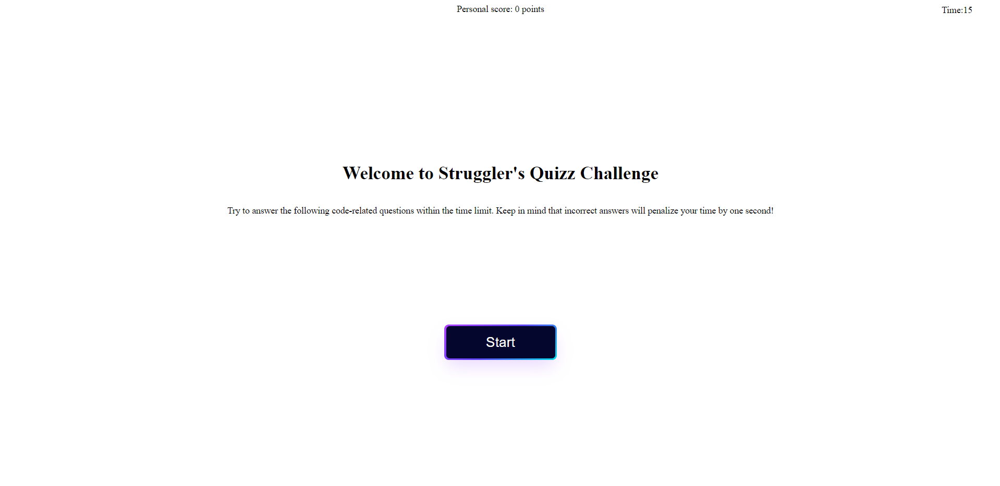

# Struggler's Portfolio Challenge

## Description

This one took almost an entire day to make but I'm happy to present my portfolio to all who wish to see it.
I obviously had a lot of fun with this and tried to implement as many cool things as I could within the timeframe.
I do believe I can do much better but this will have to do for a days work.

## Usage

To open the page, simply click on the following link: "https://strugglerxiv.github.io/Strugglers-Quizz-Challenge/"

This a screenshot showcasing the live deployed webpage on github:

## Credits

-The amazing teaching staff at the UCF coding bootcamp.

## License

MIT License

## Features

Questions will randomly appear in different order every time the quizz is started.

Answers will appear in random order everytime the question is presented.

## Acceptance Criteria
I WANT to take a timed quiz on JavaScript fundamentals that stores high scores

SO THAT I can gauge my progress compared to my peers

GIVEN I am taking a code quiz

WHEN I click the start button

THEN a timer starts and I am presented with a question

WHEN I answer a question

THEN I am presented with another question

WHEN I answer a question incorrectly

THEN time is subtracted from the clock

WHEN all questions are answered or the timer reaches 0

THEN the game is over

WHEN the game is over

THEN I can save my initials and score
